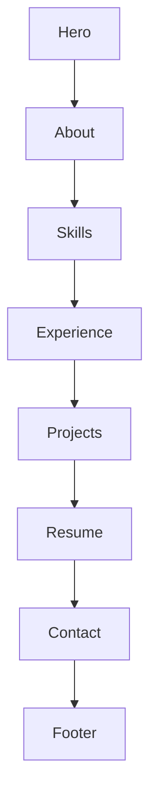
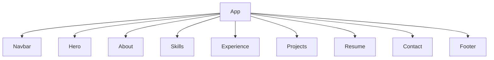
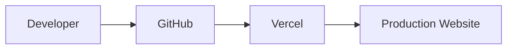
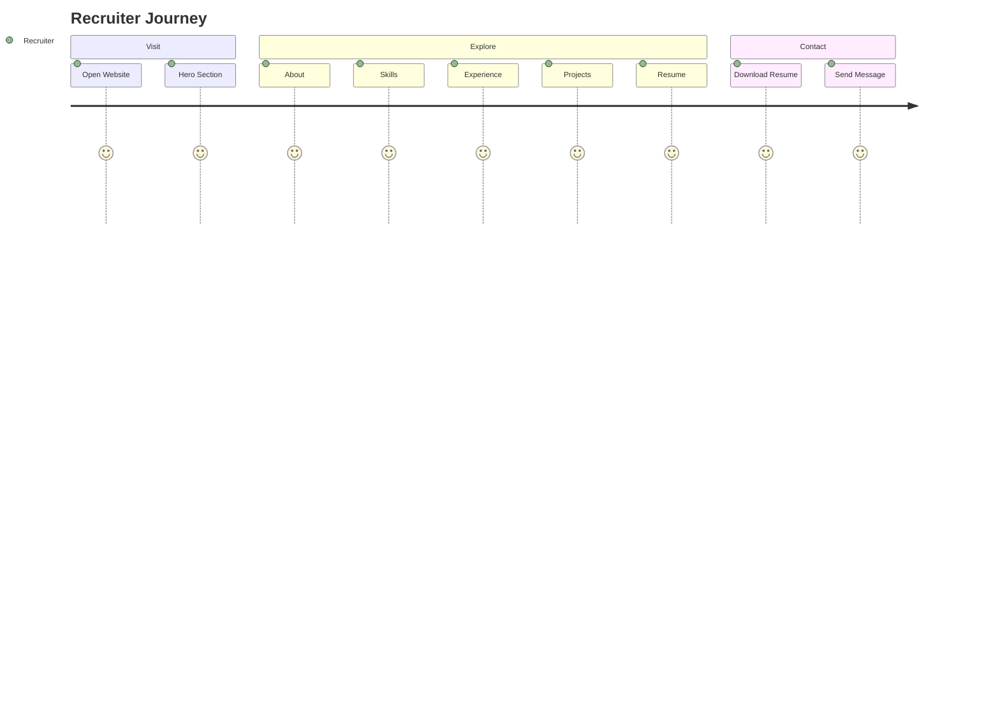

# Personal Portfolio Website

Version: 1.1

---

# Objective

Create a modern, premium-looking portfolio website that represents me as a Senior React Frontend Developer.

The website should feel like a professional SaaS product rather than a simple resume page.

## Primary Goals

- Showcase Resume
- Showcase Experience
- Showcase Projects
- Increase interview conversion
- Mobile Responsive
- Modern UI
- Fast Loading
- SEO Friendly

---

# Tech Stack (v1 decisions)

## Frontend

- **React 18** + **Vite 5** + TypeScript (current machine is Node 18; upgrade to React 19 later with Node 20+)
- **Tailwind CSS** for SaaS-like UI
- CSS variables for **one polished theme** first (theme toggle is post-v1)

## Libraries (v1)

| Library | v1 decision |
|---------|-------------|
| Framer Motion | Yes — polish after layout/content; respect `prefers-reduced-motion` |
| React Icons | Yes (when UI polish starts) |
| EmailJS (`@emailjs/browser`) | Yes — keys in `.env` only; never commit |
| `react-helmet-async` or static tags in `index.html` | Prefer strong static meta/OG in `index.html` first |
| React Router | **Skip for v1** — single-page + section IDs + smooth scroll |
| React Intersection Observer | **Skip** — use Framer Motion `whileInView` instead |
| React Helmet (legacy) | Prefer `react-helmet-async` or static HTML tags |

## Deployment

- GitHub → Vercel

---

# Website Flow (single-page scroll)



Recruiters rarely need multi-page navigation for v1. Add Router later only for project case-study pages.

---

# Component Hierarchy



---

# Folder Structure

```text
docs/
│   Resume/
│     Resume.md        ← human-editable resume source (site content derived from this)
│     README.md        ← how to update resume content + PDF + EmailJS
│
public/
│   resume.pdf         ← downloadable PDF (place your real file here)
│   robots.txt
│   sitemap.xml
│
src/
├── assets
├── components
│   ├── Navbar
│   ├── Hero
│   ├── About
│   ├── Skills
│   ├── Experience
│   ├── Projects
│   ├── Resume
│   ├── Contact
│   ├── Footer
│   └── Common
│
├── data               ← typed content loaded/parsed from docs/Resume/Resume.md
├── hooks
├── services           ← EmailJS, etc.
├── utils
├── types
├── constants          ← nav links, theme token helpers
├── App.tsx
└── main.tsx
```

Notes:

- **Content-driven:** components render typed data; they do not hardcode long bio/job text.
- **`pages/`** is unused on a single-page site — omit from v1 (add later for case studies).
- Architecture doc may later move to project root or `docs/` (optional cleanup).

---

# Content source of truth

1. Edit **`docs/Resume/Resume.md`** (structured markdown + frontmatter).
2. App parses it into typed objects under `src/data/` / `src/types/`.
3. Place the matching PDF at **`public/resume.pdf`** for Download / Open actions.
4. Do not hardcode resume copy inside components.

---

# Landing Page (Hero)

## Purpose

- First impression
- Introduce myself
- Encourage recruiter interaction

## Contains

- Name
- Title
- Professional Photo (when available)
- CTA Buttons

## Buttons

- Download Resume (PDF from `/resume.pdf`)
- Contact Me (scroll to `#contact`)
- GitHub / LinkedIn

## Motion (v1 taste)

- One strong visual system + **2–3 purposeful motions** (not typing + floating BG + button glow all at once)
- Honor `prefers-reduced-motion`

---

# About Section

## Contains

- Introduction
- Years of Experience
- Career Summary
- Interests

## Layout

Photo | Description

---

# Skills Section

## Groups (examples; real data from resume)

- Frontend, Backend, Database, Tools

## Display Style (v1)

- **Skill groups + chips/tags** (honest, cleaner)
- Avoid skill **progress bars (%)** — they read as template portfolio and hurt senior trust

---

# Experience Timeline

Each timeline card contains:

- Company
- Role
- Responsibilities
- Technologies
- Achievements

---

# Projects

Each project card should contain:

- Project Image
- Project Name
- Description
- Technology Stack
- GitHub Button
- Live Demo Button

Animations (later polish): hover / lift / smooth transition — keep subtle.

---

# Resume Section

## v1 features

- **Download Resume** (PDF)
- **Open Resume** (new tab)
- Content summary driven by `docs/Resume/Resume.md`

## Later (optional)

- Embedded PDF preview only if it stays fast on mobile

---

# Contact Section

## Fields

- Name
- Email
- Message

## Validation

- Required fields
- Email format validation

## Integration — EmailJS

- Send messages to your **Gmail** via EmailJS
- Put `VITE_EMAILJS_SERVICE_ID`, `VITE_EMAILJS_TEMPLATE_ID`, `VITE_EMAILJS_PUBLIC_KEY` in `.env` (never commit)
- Client-side spam limits are weak → also show **LinkedIn / email mailto** as fallback CTAs

---

# Footer

Contains

- GitHub
- LinkedIn
- Email
- Copyright
- Back To Top Button

---

# Accessibility (non-negotiable)

- Semantic landmarks: `header`, `main`, `section`, `footer`
- Keyboard-friendly nav and visible focus states
- `prefers-reduced-motion` — disable or simplify Framer Motion
- Alt text for photos/project images
- Proper labels on Contact form fields

---

# Theme (v1)

- Ship **one polished theme** with CSS variables / Tailwind tokens
- Dark / light / system toggle → **post-v1**

---

# Responsive Design

Support

- Desktop
- Laptop
- Tablet
- Mobile

---

# Performance Goals

| Metric | Target |
|--------|--------|
| Performance | 95+ |
| Accessibility | 95+ |
| SEO | 95+ |
| Best Practices | 95+ |

---

# SEO (honest for a Vite SPA)

Meta/OG/Twitter tags are still worth doing. True crawl depth is limited without prerender/SSR.

## v1

- Strong `index.html` title/description + OG tags
- `robots.txt` + `sitemap.xml`
- Optional later: prerender or move critical text into static HTML

---

# Deployment Flow



---

# Future Enhancements (explicitly post-v1)

- React Router / project detail pages
- Theme toggle (dark / light / system)
- PDF iframe preview
- Blog
- Admin Dashboard
- Visitor Analytics
- GitHub Contribution Graph
- Certifications
- Testimonials
- AI Chatbot
- Multi-language Support
- React 19 upgrade (after Node upgrade)

---

# Recruiter User Journey



---

# Development Phases (adjusted)

## Phase 1 — Done / finishing

- Vite + React 18 + TypeScript setup

## Phase 2 — Foundation

- Tailwind + folder structure + typed `data/` from `docs/Resume/Resume.md` + one theme

## Phase 3 — Core UI

- Navbar, Hero, About, Skills (tags, not bars)

## Phase 4 — Proof

- Experience timeline, Projects, Resume download/open

## Phase 5 — Convert

- Contact (+ EmailJS), Footer, LinkedIn/email fallbacks

## Phase 6 — Polish

- Motion, SEO, a11y, Lighthouse, Vercel deploy

---

# End Goal

The final website should make recruiters think:

> "This developer knows modern frontend development, writes clean code, and pays attention to design, performance, and user experience."
